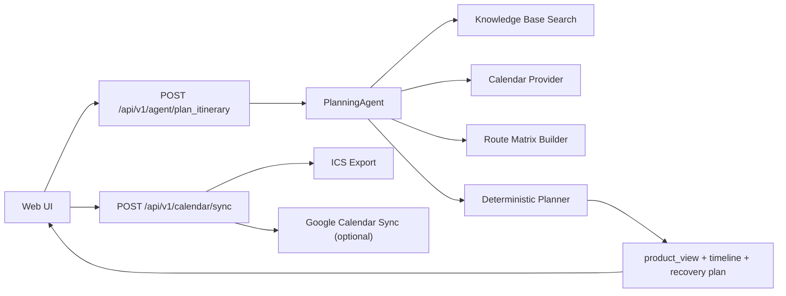

# Orient

> [中文 README](README.md) · English README (current file)

A locally runnable, demo-ready AI product demo. It is not a generic "Student
Assistant" — it focuses on one real, high-frequency, high-pressure moment for a
campus newcomer:

**Should this newcomer go check in at the dorm right now? If they leave now,
where should they go first, what missing item could block them, and if there
isn't enough time, how should the system replan?**

The goal of this project is not to pile on features, but to turn a single
campus scenario into a demo with **product judgment, real edge cases, and
portfolio appeal**.


## Why This Project Stands Out

- **A specific problem**: narrowed down from a broad campus assistant to the
  high-pressure moment of "move-in / check-in day for a newcomer."
- **Not a chat wrapper**: the core scheduling is done by a deterministic
  planner that can explain why the tasks can or cannot be finished today.
- **Product-grade edge cases**: it doesn't just hand you one smooth route — on
  failure it directly proposes a more reliable next start plan.
- **Playable right away**: the homepage ships 3 one-click demo presets, so you
  see different outcomes within seconds.
- **A real sense of delivery**: time-window conflicts, route ordering, material
  checks, a Calendar Confirmation Card, ICS export, and optional Google
  Calendar sync form a complete loop.

## Demo Scenarios

The project ships three product scenarios that are best for demos. You can
switch between them with one click after opening the page:

| Preset | What it shows | Expected result |
| --- | --- | --- |
| `Standard move-in day` | Arrive in the morning as usual; check whether everything can be finished today | A successful same-day route |
| `Arriving at noon` | Departure is too late; shows how the system advises against it and reschedules | `Reschedule suggested` + an executable next plan |
| `Core materials ready` | Auto-checks the 6 common materials; see whether the first step can start directly | The first node becomes `Materials ready` |

### 1. Standard Day


### 2. Late Arrival Recovery


### 3. Core Materials Ready


## Product Highlights

### 1. A conclusion at a glance, not a wall of route text

The page answers three things first:

- Can everything still be finished today
- Where to go first right now
- Which step is most likely to get blocked by a time window or missing material

### 2. The timeline is not a static list

- Automatically avoids fixed commitments in the class schedule
- Accounts for walking time between locations
- Decides ordering based on window times
- Shows only the first 3 steps by default to avoid first-screen overload

### 3. Material check is a "pre-departure check," not a pile of form fields

- First shows the materials needed for the very first step
- Then shows the follow-up materials needed gradually afterward
- Supports one-click checking of the 6 common items to quickly demo "can the
  first step start directly?"

### 4. The failure scenario has product design too

If today can't be made, it doesn't just return `blocked`. The system goes on to
provide:

- A recommended next date
- A recommended start time
- A condensed alternative timeline
- The first thing to do

### 5. The last step lands on the calendar

- Generates a `Calendar Confirmation Card`
- Supports ICS export
- Supports optional Google Calendar sync

## Architecture



## Core Design Choices

### Local-first demo

- No database
- No frontend build chain
- Ready to demo immediately after startup

### Deterministic planning over pure LLM output

The most critical judgments in this project — "can it be finished?" and "where
to go first?" — do not rely on free-form model output, but on:

- Fixed schedules
- Department time windows
- Route durations
- The ordering of task nodes

This keeps the output stable and makes it a better portfolio case study.

### Product view as a first-class response

The backend does not only return the low-level `timeline`; it also returns a
`product_view` that the frontend can render directly:

- `headline`
- `subheadline`
- `next_step`
- `finish_time`
- `material_status`
- `recovery_plan`

This makes the frontend/backend relationship feel like a real product rather
than a raw JSON dump.

## Run Locally

```bash
cd Campus-Intelligent-Assistant
python3 -m backend.server
```

Then open [http://127.0.0.1:8000](http://127.0.0.1:8000).

## Test

```bash
python3 -m unittest discover -s tests
```

## API Surface

### `POST /api/v1/agent/plan_itinerary`

The local agent orchestration entrypoint. Returns:

- `status`
- `timeline`
- `alerts`
- `product_view`
- `calendar_sync_candidates`
- `knowledge_hits`

### `POST /api/v1/calendar/sync`

Supports:

- `provider=ics`
- `provider=google`

## Project Structure

```text
backend/
  agent.py                 # Agent orchestration and product_view assembly
  planner.py               # Deterministic time-window planner
  knowledge_base.py        # Local retrieval and evidence snippets
  calendar_provider.py     # Built-in calendar + uploaded JSON / ICS parsing
  calendar_sync.py         # ICS export and optional Google sync
  scenario_store.py        # Loads scenarios.json: locations, tasks, destinations
  skills.py                # Shared skill entrypoints
  utils.py                 # Time parsing/formatting and walk-time estimation
  data/
    calendars/             # Sample class schedules
    knowledge_base/        # Scenario documents
    scenarios.json         # Tasks, windows, locations, destinations
static/
  index.html               # Productized newcomer assistant UI
  app.js                   # Client-side orchestration and rendering
  styles.css               # Portfolio-style visual system
examples/uploads/
  heavy_day.ics            # Busy-day demo file
  student_card_reissue.json
docs/screenshots/
  standard.png
  late-arrival.png
  materials-ready.png
```

## Demo Files

- A too-busy-to-make-it class schedule sample: [examples/uploads/heavy_day.ics](examples/uploads/heavy_day.ics)
- An extra task scenario sample: [examples/uploads/student_card_reissue.json](examples/uploads/student_card_reissue.json)

## Optional Environment Variables

- `GOOGLE_CALENDAR_ACCESS_TOKEN`
- `GOOGLE_CALENDAR_ID`

## What I Would Build Next

- Map and location data closer to a real school
- Multiple newcomer task chains: dorm check-in, campus card, student ID,
  payment, SIM card
- Turn `recovery_plan` into a true alternative-plan compare view
- User-owned calendar import and long-term preference saving

## License

This project is open-sourced under the [MIT License](LICENSE) — free to use,
modify, and distribute.
