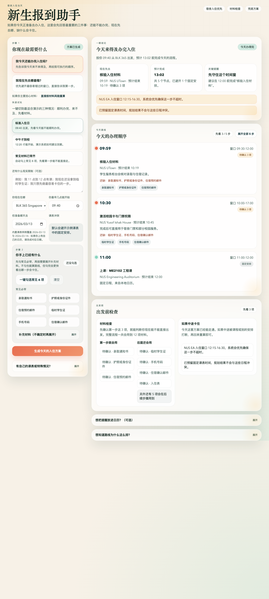
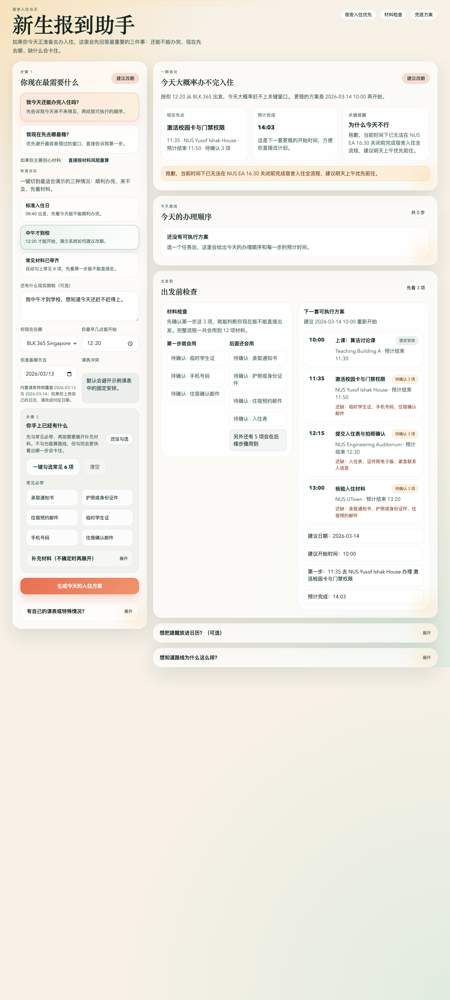
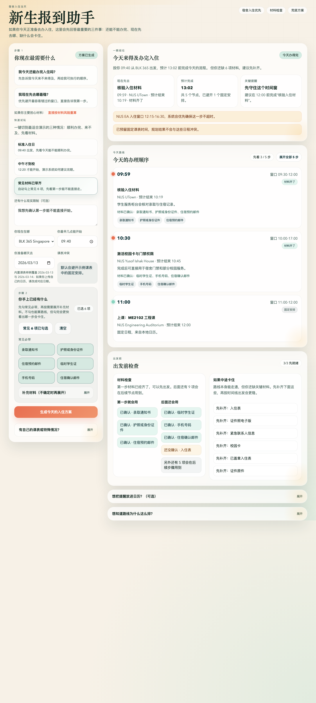
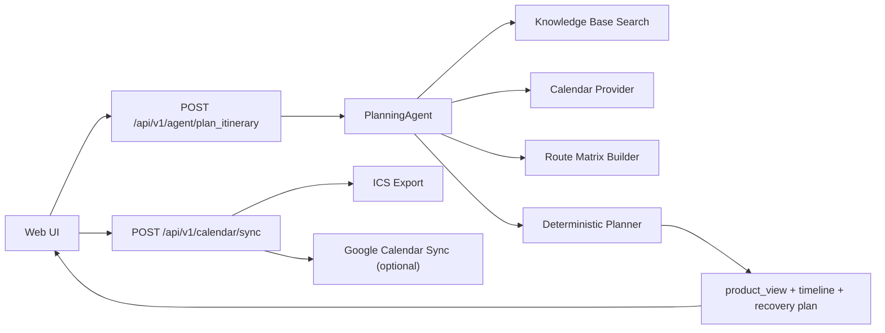

# 新生报到助手 · Orient

> 中文 README（当前文件） · [English README](README.en.md)

一个本地可运行、可直接演示的 AI product demo：它不再是泛泛的 “Student Assistant”，而是聚焦在一个真实又高频的瞬间问题上:

**新生今天要不要立刻去办宿舍入住？如果现在出发，先去哪，缺什么会卡住，来不及时系统又该怎么改计划？**

这个项目的目标不是堆功能，而是把一个校园场景做成 **有产品判断、有 edge case、有作品集展示力** 的 demo。



## Why This Project Stands Out

- **题目够具体**：从宽泛的校园助手，收敛到“新生报到/入住当天”的高压场景。
- **不是聊天壳子**：核心排程由确定性 planner 完成，能解释为什么今天能办完或办不完。
- **有产品级 edge case**：不是只给一条顺利路线，还会在失败时直接给出下一套更稳的开始方案。
- **能直接试玩**：首页内置 3 个一键 demo 预设，几秒内就能看见不同结果。
- **有真实交付感**：时间窗冲突、路线顺序、材料检查、Calendar Confirmation Card、ICS 导出、可选 Google Calendar sync 都是完整闭环。

## Demo Scenarios

项目内置三种最适合展示的产品场景，打开页面后可以一键切换：

| Preset | What it shows | Expected result |
| --- | --- | --- |
| `标准入住日` | 正常上午到校，先看今天能不能办完 | 成功规划当天路线 |
| `中午才到校` | 出发时间过晚，展示系统如何劝退和改期 | `建议改期` + 下一套可执行方案 |
| `常见材料已带齐` | 自动勾选常见 6 项材料，先看第一步是否能直接走 | 第一节点变成 `材料齐了` |

### 1. Standard Day


### 2. Late Arrival Recovery



### 3. Core Materials Ready



## Product Highlights

### 1. 一眼结论，而不是一大段路线

页面优先回答三件事：

- 今天还能不能办完
- 现在先去哪
- 哪一步最容易因为时间窗或材料被卡住

### 2. 时间线不是静态列表

- 自动避开课表里的固定安排
- 考虑地点之间的步行时间
- 根据窗口时间决定先后顺序
- 默认只显示前 3 步，避免首屏信息过载

### 3. 材料检查是“出发前检查”，不是表单堆砌

- 先看第一步就要用到的材料
- 再看后续会逐步用到的补充材料
- 支持一键勾选常见 6 项，快速演示“第一步能直接走吗”

### 4. 失败场景也有产品设计

如果今天赶不上，不会只返回 `blocked`。系统会继续给出：

- 下一套推荐日期
- 推荐开始时间
- 精简版替代时间线
- 第一件该做的事

### 5. 最后一步能落到日历

- 生成 `Calendar Confirmation Card`
- 支持导出 ICS
- 支持可选 Google Calendar sync

## Architecture



## Core Design Choices

### Local-first demo

- 无数据库
- 无前端构建链
- 启动后即可直接演示

### Deterministic planning over pure LLM output

这个项目里最关键的“能不能办完”和“先去哪”的判断，不依赖模型自由发挥，而是依赖：

- 固定日程
- 部门时间窗
- 路线耗时
- 办事节点顺序

这样输出更稳定，也更适合做 portfolio case study。

### Product view as a first-class response

后端不只返回底层 `timeline`，还会同时返回前端直接可渲染的 `product_view`：

- `headline`
- `subheadline`
- `next_step`
- `finish_time`
- `material_status`
- `recovery_plan`

这让前后端关系更像真实产品，而不是一个原始 JSON dump。

## Run Locally

```bash
cd Campus-Intelligent-Assistant
python3 -m backend.server
```

然后打开 [http://127.0.0.1:8000](http://127.0.0.1:8000)。

## Test

```bash
python3 -m unittest discover -s tests
```

## API Surface

### `POST /api/v1/agent/plan_itinerary`

本地 agent 编排入口，返回：

- `status`
- `timeline`
- `alerts`
- `product_view`
- `calendar_sync_candidates`
- `knowledge_hits`

### `POST /api/v1/calendar/sync`

支持：

- `provider=ics`
- `provider=google`

## Project Structure

```text
backend/
  agent.py                 # Agent orchestration and product_view assembly
  planner.py               # Deterministic time-window planner
  knowledge_base.py        # Local retrieval and evidence snippets
  calendar_provider.py     # Built-in calendar + uploaded JSON / ICS parsing
  calendar_sync.py         # ICS export and optional Google sync
  scenario_store.py        # Loads scenarios.json: locations, tasks, destinations
  skills.py                # Shared skill entrypoints
  utils.py                 # Time parsing/formatting and walk-time estimation
  data/
    calendars/             # Sample class schedules
    knowledge_base/        # Scenario documents
    scenarios.json         # Tasks, windows, locations, destinations
static/
  index.html               # Productized newcomer assistant UI
  app.js                   # Client-side orchestration and rendering
  styles.css               # Portfolio-style visual system
examples/uploads/
  heavy_day.ics            # Busy-day demo file
  student_card_reissue.json
docs/screenshots/
  standard.png
  late-arrival.png
  materials-ready.png
```

## Demo Files

- 忙到来不及的课表样例: [examples/uploads/heavy_day.ics](examples/uploads/heavy_day.ics)
- 额外办事场景样例: [examples/uploads/student_card_reissue.json](examples/uploads/student_card_reissue.json)

## Optional Environment Variables

- `GOOGLE_CALENDAR_ACCESS_TOKEN`
- `GOOGLE_CALENDAR_ID`

## What I Would Build Next

- 更贴近真实学校的地图与地点数据
- 多种新生任务链路: 宿舍入住、校园卡、学生证、缴费、SIM 卡
- 把 `recovery_plan` 做成真正的 alternative plan compare view
- 用户自己的日历导入与长期偏好保存

## License

本项目基于 [MIT License](LICENSE) 开源，可自由使用、修改与分发。
